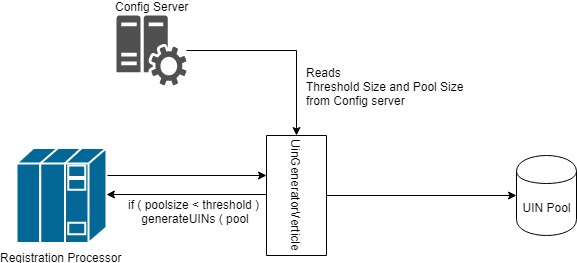
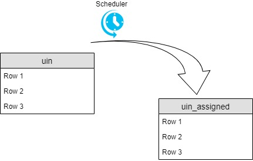
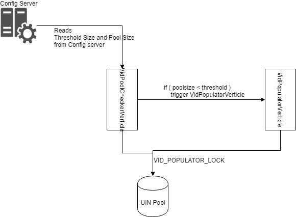

# Id Generator - UIN and VID

#### Background

UINs and VIDs have to generted satisfying the necessary criteria defined by the country. There can be millions of UINs and VIDs have to be generated during the lifetime of MOSIP. The time it takes to generate these unique IDs are based on the criteria and conditions placed on them.
UINs are needed when a new UIN is assigned to an individual. VIDs can be generated and used at will by the inviduals.  

#### Solution

**The key solution considerations in UIN generations are**

- Following are the key considerations for the UIN generation functionality, 
	1. Maintaining a buffer pool:
		A buffer pool of pre-generated UINs have to be maintained. The recommended pool size is 4 times the size of expected UINs, which have to be issued daily. This pool will help the Registration Processor to get the UIN as soon as possible. 
	2. Vert.x implementation
		There are 2 verticles which will be maintained. One will generate the UIN and another will clear up the used UINs to another table. Hence, the transaction table, which issues the UIN will be kept low on size. 
		
		The UinGeneratorVerticle verticle generates the UINs and keeps the required pool size. The Registration Processor is served with the UINs and when the pool size shriks less than the threshold size, again the UINs are regenerated into the UIN pool. 
		
		
		
		The UinTransferVerticle	sweeps through the "uin" database table and finds the used UINs based on the uin_status column. And moves all of these UINs to "uin_assigned" database table.
		
		
		
		

**The key solution considerations in VID generations are**

- Following are the key considerations for the VID generation functionality, 
	1. Maintaining a buffer pool:
		A buffer pool of pre-generated VIDs have to be maintained. The pool size is based on the usage trend. But generally 50% of the total UINs is recommended as a pool size. 
		
	2. Vert.x implementation
		There are 3 verticles which will be maintained. The verticles are used for 1. VID checker, 2. VID generator and 3. Expiring VIDs. 
		
		The VidPoolCheckerVerticle verticle checks whether the existing pool size is of the size of necessary configured pool size. If not, VidPopulatorVerticle verticle kicks in to generate the necessary VIDs. A lock is acquired when the VidPopulatorVerticle is running. 
		
		
		
		The VidExpiryVerticle verticle recycles the expired VIDs. It returns back the expired VIDs to unused state and can be recycled. Currently, there is no cool-off period configured. Hence, the expired VIDs will be returned to available pool immediately. 