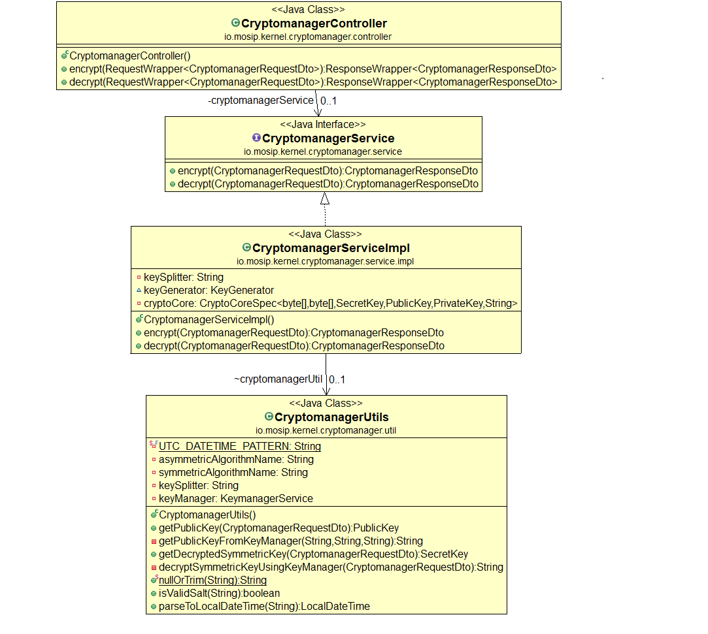

# Encryption and Decryption

#### Background

This library can be used to encrpyt and decrypt data based on defined set of algorithms. It contains several methods that accept symmetric key and asymmetric key pairs for encryption and decryption.

- Symmetric key


- Asymmetric public key


- Asymmetric private key


#### Solution


**The key solution considerations are**


- Create an interface for encryptor and decryptor having required method declaration, which will be exposed to the other applications.


- Create a project which implements encryptor and decryptor with set of algorithms based on Java Crypto Extension (JCE) API.


- Encryptor and Decryptor can be used in any MOSIP module for encryption and decryption after adding crypto implementation to their class path


** Class Diagram**





# Key Manager

**1. Background**

In the MOSIP platform, there are many types of keys used in various modules. The users might book an appointment using the Pre-Registration module. During this the users uses the public key to encrypt the message and Pre-Registration module uses the private key to decrypt the message. When these packets are pulled by the Registration module, the Registration module can use the public key of Pre-Registration module to establish the connection.

The keys should be maintained and managed as a separate entity apart from the actual modules. These keys are rotated based on a specific security policy.


**2. Solution**

The key solution considerations are

- Following are the major components in the Key Manager,
  1. Key generation algorithms.
  2. Key rotation module, which will generate the new keys and map to the application for a specific timeframe.
  3. A RESTful micro service, which will serve the public keys of the requested application.
  4. Validator module to check the authenticity of the caller.
  5. Key store to store the keys.


- The sequence of the key generations and the rotation of the keys are as follows,
  1. During the initial setup, the key rotation duration are configured.
  2. Applications are associated to the key rotation configuration
  3. The key expiration check is done during the request time.
  4. The decryption of data happens inside the key manager module.
  5. The public key is returned to the requester.

***2.1 Sequence diagrams***

Following are the various sequences of the flow between the various modules. The following diagrams represents any 2 applications interactions at any point of time. 

****2.1.1 Pre-registration --> Registration****

Following is the sequence diagram of the communication between the Pre-registration and the Registration application, 


****2.1.2 Registration --> Registration Processor****

Following is the sequence diagram of the communication between the Registration and the Registration Processor application, 


****2.1.3 TSP --> IDA:****

Following is the sequence diagram of the communication between the TSP and the IDA application, 


****2.1.4 IDA --> Kernel****

Following is the sequence diagram of the communication between the IDA and the Kernel application, 


Following is the flow chart for the step &quot;certValidityCheck()&quot;,


**2.2 Encryption and Decryption Steps (CryptoManager)**

**Encryption**

1. Request received for data encryption along with applicationId, ReferenceId(optional) and the timestamp(current timestamp of encryption). ReferenceId could be multiple instance of entity within Application such as MachineId and TspID for REGISTRATION and IDA respectively. Data to be encrypted is sent as Base64 encoded. Additional salt can bes sent in Base64 encoded to be used for  initialization vector (IV) for symmetric encryption. 
2. Generate session symmetric key for the request and encrypt the data using it.
3. Use/Request for Application and ReferenceId specific public key (based on timestamp) and encrypt symmetric key using it.
4. Combined the encrypted data and symmetric key separated by key-splitter and respond back as Base64 encoded string.

**Decryption**

1. Request received for encrypted data decryption along with applicationId, ReferenceId(optional) and the timestamp(encryption timestamp).
2. Decode the content from Base64 encoded string and split the data and symmetric key.
3. Pass the symmetric key along with ApplicationId,ReferenceId and Timestamp(encryption timestamp) to KeyManager service to decrypt. If additional salt was  sent in Base64 encoded to be used for  initialization vector (IV) for symmetric encryption, same salt need be sent for decryption. 
4. Use the decrypted symmetric key to decrypt data and respond back. 


**2.3 Asymmetric key storage and validation (KeyManager)**

**Get Public Key**

1. Request received for public key for the specific ApplicationId, ReferenceId(optional) and the timestamp. ReferenceId could be multiple instance of entity within Application such as MachineId and TspID for REGISTRATION and IDA respectively.If ReferenceId is not present fetch the public key from SoftHsm for ApplicationId else fetch it from KeyStore DB.

2. If ReferenceId is not present, Fetch the key-alias for the ApplicationId at given timestamp from KeyAlias DB. Fetch the public key from SoftHSM for the key-alias and respond back.If there is no key-alias for ApplicationId and Timestamp then generate a new KeyPair based on expiry and overlapping policy and store in SoftHSM.
 
3. If ReferenceId is present, Fetch the key for the ApplicationId/ReferenceId at given timestamp from KeyStore DB and respond back with public key. If there is no key present for given ReferenceId and Timestamp then generate a new KeyPair based on expiry and overlapping policy and encrypt the private key using ApplicationId's public key (using master key-alias) and store in KeyStore and KeyAlias DB.


**Decrypt Symmetric Key**

1. Request received for encrypted data(Symmetric Key) decryption along with specific ApplicationId, ReferenceId(optional) and the timestamp(encryption timestamp). ReferenceId could be multiple instance of entity within Application such as MachineId and TspID for REGISTRATION and IDA respectively. If ReferenceId is not present decrypt the data using ApplicationId's private key else use ReferenceId's Private key for decryption.

2. If ReferenceId is not present,Fetch the Private key of ApplicationId from SoftHSM and decrypt the data(Symmetric Key).

3. If ReferenceId is present, Fetch the key for the ApplicationId/ReferenceId at given timestamp(encryption timestamp) from KeyStore DB and decrypt the ReferenceId's private key with ApplicationId's private key (using master key-alias). Use decrypted ReferenceId's private key to decrypt the data(Symmetric Key).


**ERD**


# License key generation and validation

#### Background

TSPs call the IDA to authenticate the Individuals. There can be various service calls such as Demographic, biometric based authentications. Each service calls have the permission associated. When a service call comes to the IDA, a request is sent to the Kernel module to retrieve the permissions for the License Key.
This service can be used to generate,assign permission and validate License key based on expiry date, suspended or blocked for a TSP Id. Service has REST API exposed for fetching and validating License key. 

#### Solution


**The key solution considerations are**

- A service is defined to receive the request to generate a new license key for a TSP. 

- Another service associates the license key with the list of permissions. 

- Another service accepts the incoming requests from the TSPs should be validated for authentication. Check whether the TSPs has the valid license.  

- Then the permissions are retrieved for the identified TSPs. 

- Return the permissions associated with the License keys.  

**Module diagram**


- Request body model for licenseKey generate POST **/license/generate**


```
{
  "licenseExpiryTime": "2019-03-07T10:00:00.000Z",
  "tspId": "9837"
}
```
**Example Response**

```JSON
{
  "licenseKey": "gR7Mw7tA7S7qifkf"
}
```

- Request body model for licenseKey-Tsp map POST **/license/permission**


```JSON
{
  "licenseKey": "gR7Mw7tA7S7qifkf",
  "permissions": [
    "OTP Trigger","OTP Authentication"
  ],
  "tspId": "9837"
}
```
**Example Response**

```JSON
{
  "status": "Mapped License with the permissions"
}
```


- Request for Validation and Permissions Get **/license/permission**


```
license/permission?licenseKey=gR7Mw7tA7S7qifkf&tspId=9837
```

**Example Response**

```JSON
{
  "permissions": [
    "OTP Trigger",
    "OTP Authentication"
  ]
}
```


**Class Diagram**


**ERD**


# Digital signatures

#### Background

Digital signatures are needed in various places of the MOSIP system. Few example can be, in the Registration client, the operator like to digitally sign the packet. Or, every request from the server can be digitally once again signed by the server. 

#### Solution


**The key solution considerations are**

- Following are the steps to digitally sign the services in the system, 

1. Create a hash for the web service response using cryptomanager APIs. 

2. Encrypt the hash using the existing "/cryptomanager/v1.0/encrypt" service can be used. In the "referenceId", the value as "HASH" can be passed.

3. Once the has is encrypted, the encrypted hash is sent as part of the header. 

4. The client is supposed to have the latest public key which is active on that date. 

5. Signature have to be enforced in the all the API's which the server hosts. 

- Create a common utility java project which creates the signature. 

- Use this common utility project, attach the signature in all the response. 


**Module diagram**


# TokenID Generator

#### Background

A Token ID can be requested by an Indivudual against his UIN. A library should be able to generate an unique ID and assign it against a UIN. When a request comes to retrieve a Token ID agains UIN, the system should return a mapping, if already exists. Otherwise, a mapping should be created and returned.  

#### Solution


**The key solution considerations are**


- The API will generate a unique number against the configurations. 

- The configurations are injected by the caller of the module. These configurations are defined in the config server. 


**Module diagram**


** ID Generator Algotithm **

 [ID Generator Algotithm](kernel-id-generators-algorithm.md)


**Class diagram**


