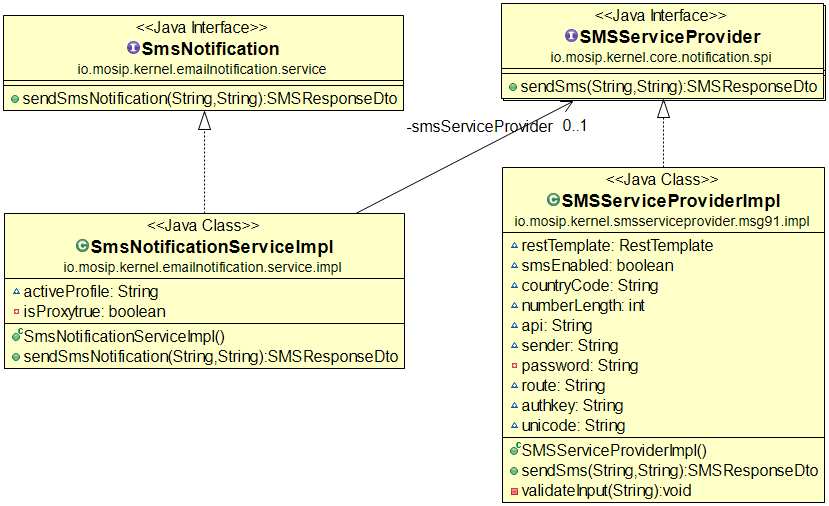

# Email Notification Service

#### Background

This service can be used to send email through configured SMTP server. Service has REST API exposed to send messages and attachments through Email. 


#### Solution


**The key solution considerations are**


- Create a project which provides REST service to send email.


- REST service can be used by any MOSIP module to send email through HTTP client.


- Request body model for POST **/notifier/email**

(curl sample)

```
-H "Content-Type: multipart/form-data" 
-F "attachments={}" 
-F "mailCc=user1@gmail.com" 
-F "mailContent=OTP for Auth" 
-F "mailSubject=OTP" 
-F "mailTo=admin1@gmail.com"
```


- Response body model for POST **/notifier/email**

HttpStatus: 202 Accepted


```
{
  "status": "Email Request submitted"
}
```

**Class Diagram**


# SMS Notification Service

#### Background

This service can be used to send sms through configured SMS gateway. Service has REST API exposed to send messages through SMS. 


#### Solution


**The key solution considerations are**


- Create a project which provides REST service to send SMS.


- REST service can be used by any MOSIP module to send SMS through HTTP client.


- Request body model for POST **/notifier/sms**

```
{
  "message": "OTP-66776666",
  "number": "8980889888"
}
```


- Response body model for POST **/notifier/sms**

HttpStatus: 202 Accepted

```
{
  "status": "success",
  "message": "Sms Request Sent"
}
```


**Class Diagram**



