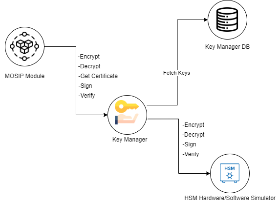
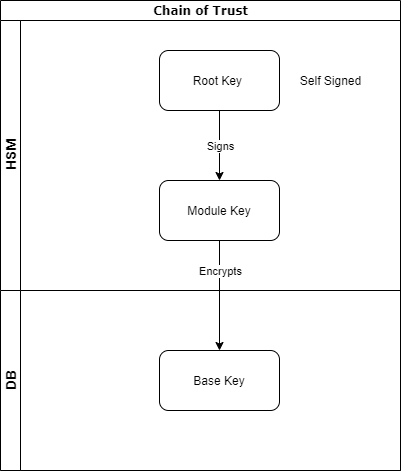
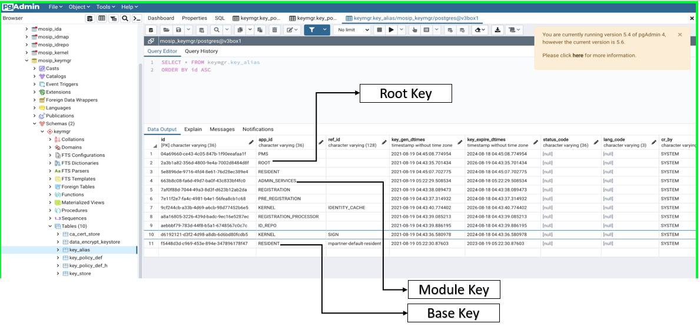
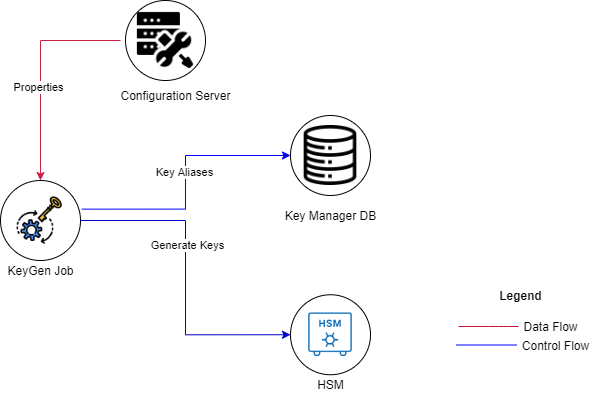

# Key Manager #

## Overview ##

The Key Manager service provides secure storage, provisioning and management of secret data. It provides all the cryptographic operations like encryption/decryption & digital signature/verification making one trust store for all partner trust path validation. It manages the lifecycle of encryption/decryption keys, including generation, distribution, administration, and deletion.

This includes keying material such as symmetric keys, asymmetric keys, certificates and algorithm data.  It is a web-based key management solution that helps consolidate, control, manage, monitor, all key generation & maintenance of key life cycle required in MOSIP. 

Keymanager interfaces with key store like Hardware Security Module (HSM) and Database.



## Encryption alrogithms
* RSA-256 for all data encryption
* AES-256 for zero-knowledge encryption (specific design for IDA data storage)

## Keys and certificates in MOSIP
1. ROOT key 
1. Module keys
1. Encryption keys (also called Base keys)

|Key|Location|Issuer|
|---|---|---|
|ROOT|HSM|Self signed|
|Module|HSM|ROOT|
|Encryption|Database|Module|

**Chain of trust**



Encryption keys are generated by MOSIP applications, encrypted further by Module keys and stored in the DB in `key_store` table while ROOT and Module keys reside in the HSM.  The aliases of all these keys are available in
`key_alias` table of `mosip_keymgr` DB.

Key Manager stores the path of the encryption key + partner certificate (no private key) in a configuration file named ```key_store``` with an unique UUID & also has mapping of master key used. Key Manager does not allow you to store the encryption key within the Key Manager. This is done to prevent storing of both the encrypted key and encrypted data, in both live and backed-up database, together in the same place.


**Example**



## Generate and deploy new keys

### Key mapping ###

 You can map/identify the key with mentioned two attributes:

```APPLICATION_ID (APP_ID)``` -  MOSIP component name is APP_ID

Eg: REGISTRATION

```REFERENCE_ID (REF_ID) ```- blank for master key, specific name in case of encryption key (base key)

Eg: 10001_110011

It also provides a graphical map of key-user relationships that helps you effectively track the distribution and usage of keys within your network.

### Key generation process ##

Key Manager helps you generate new key pairs and deploy them to endpoint servers. There are two ways that allows to generate fresh key pairs from Key Manager.
*	key-generator job, and
*	Rest API call



The job generates option under ``` key-generator job ``` allows you to generate all the configured ```APP_IDs``` master keys in HSM. It associate only module keys.

Alternatively, you can also generate key using Rest API call ```/keymanager/generateMasterKey``` and simultaneously deploy them to various user accounts. This can be done with help of ```KEY_MAKER``` wherein it is not required generating key with generator job.

### Generate Encryption keys ###

Key Manager stores the path of the encryption key in a configuration file with an unique UUID. Therefore, Encryption keys are automatically generated if it’s not available in Database. 

Once the API repository that allows call on ```getCertificate/generateCSR``` API will automatically generates the key if not available in Database and returns the certificate/CSR.

### Perform and track key management operations ###

Once keys are associated with their user, you can perform a range of key management operations like crypto that allows:

* Digital signing of data using Module key
* Data encryption using Encryption key


The different key in MOSIP have their own built-in validity as mentioned:

*	MOSIP root key - 5 years
*	Module key - 3 years
*	Encrytion key (base key) - 2 years

You can edit key validity before key generation by updating the required values in ```key_policy_def``` table.

### Key Revoke/Rotate ###

You can configure existing key to revoke MOSIP root key or module key invoke ```/keymanager/generateMasterKey``` API with **force** attribute as **true**. API invalidates existing key and immediately generates new key.
 
Whereas, you can configure existing key to revoke encryption/base key invoke ```/keymanager/revokeKey``` Rest API with the respective ```APP_ID``` and ```REF_ID```.

## Encryption/Decryption Process ##


We strongly recommend that you store the encryption key outside Key Manager server - preferably in any other separate machine or in any external drive (hard drive, thumb drive etc.,). And in such cases, you have to make sure that Key Manager server has full permission to access the device and the encryption key stored in it, whenever you start Key Manager service.

### Encryption Process ###

*	Random AES 256-bit key will be generated, generated random key will be used to encrypt the actual registration packet
*	Random generated key will be encrypted using the certificate received from server. Certificate contains RSA 2048 bit key
*	Certificate Thumbprint will be computed
*	Thumbprint will be prepend to encrypted random key for key identification
*	Finally encrypted random key with prepended thumbprint will be concated with encypted registration packet using #KEY_SPLITTER# as seperator

### Decryption Process ###

*	Registration packet data will be splited to get the encrypted random key, encrypted registration data, certificate thumbprint
*	Identifies the respective private key to decryption process
*	Identified private key will be decrypted with the mapped master key
*	Decrypted private key will be used to decrypt the encrypted random key
*	Decrypt the registration packet using the decrypted random key
*	Returns the decrypted data to REG_PROC

### Encryption in Reg-Client ###

*	Reg-client sends request to sync data service for the client configuration data
*	Sync Data service requests KeyManager service to provide the reg-client specific certificate. Key identifier will be APP_ID - REGISTRATION, REF_ID - CENTER-ID_MACHINE-ID
*	Keymanager service generate a new key pair, encrypts the private key with REGISTRATION master key and creates a new cerificate using same master. 
*	Returns the certificate to sync data service. If key pair already available and is valid, returns the available certificate
*	Sync data service send the certificate to reg-client
*	The registration packet will be encrypted using the certificate received from the server after collecting all required data for registration, including adding the digital signatures required to the registration data, and before saving/writing the data on the reg-client hard-disk
*	REG_PROC sends request to decrypt the data to key manager service with same app_id & ref_id


